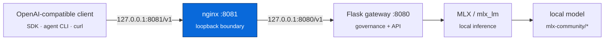
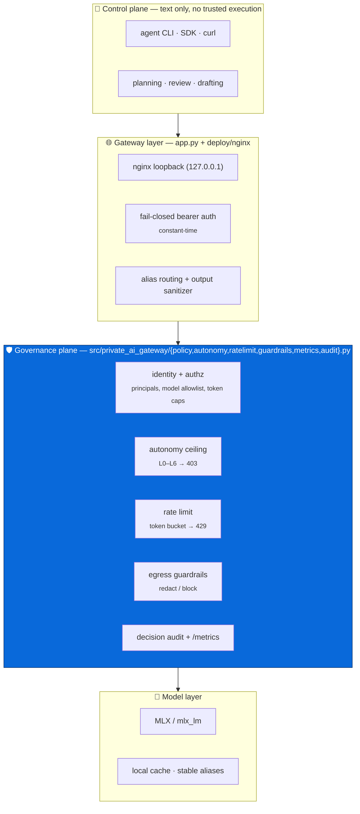

# Architecture

## Goal

A local-first, OpenAI-compatible inference gateway for Apple Silicon (MLX), designed
around one principle: **a model's ability to produce text is not authority to act.**
Model access is mediated through a controlled gateway and a loopback boundary rather
than wired directly into tool execution.

## Request path

`deploy/nginx/nginx.conf` → `src/private_ai_gateway/app.py` → Apple Silicon. Nothing
binds beyond `127.0.0.1`.

## Planes

The system separates *deciding what to do* from *doing it* — the boundary that keeps a
local model from silently gaining execution authority. Each plane is a distinct layer
with its own responsibility:

The **operator wrappers** (`agents/wrappers/`, owner-run only) are deliberately
least-privilege and sit outside the request path: `opencode.sh` does read-only
engineering inspection + syntax tests inside a project-root jail; `openclaw.sh` does
monitoring-only status/log summarization with no process control. See
[`agents/README.md`](../agents/README.md).

## Model routing

Clients request a stable **alias**; the gateway resolves it to a concrete model and
lazily swaps models on demand (clearing the MLX cache between loads).

| Alias | Model | Purpose |
|---|---|---|
| `strategy` | `mlx-community/Qwen3.6-27B-OptiQ-4bit` | planning, architecture, review |
| `engineering` | `mlx-community/Qwen3-Coder-30B-A3B-Instruct-8bit` | code / script-heavy work |
| `offsec` | `mlx-community/Llama-3-70B-Instruct-Gradient-1048k-4bit` | long-context security analysis |

The alias table is the single source of truth in `ROUTE_MAP`
([app.py](../src/private_ai_gateway/app.py)).

## Gateway controls

- Qwen thinking disabled via `enable_thinking=False`.
- Multiple system messages merged before chat-template rendering (Qwen constraint).
- Visible `<think>` wrappers stripped from output.
- Tool / channel / control markers stripped from output.
- Attempted tool-call output **blocked** and replaced with a text-only fallback — the
  gateway refuses to fake tool execution rather than passing it through.
- Per-request output tokens clamped to a per-model cap.
- All requests audit-logged.

See [security-model.md](security-model.md) for the trust boundaries and known limits.

## Governance plane

Authorization is **policy-as-code**, not logic baked into the request handler. A TOML
policy file (`config/policy.toml`, parsed with stdlib `tomllib`) defines principals:

- **Identity** — each principal is keyed by the **SHA-256 hash** of its API key; keys are
  never stored in plaintext. The gateway hashes the presented bearer token to resolve the
  principal (`policy.py`).
- **Authorization** — each principal carries an `allowed_models` list and an optional
  `max_output_tokens` cap. A request for a model outside the allowlist returns `403`;
  governance can only *tighten* token caps, never loosen them.
- **Autonomy ceiling** — each principal carries a `max_autonomy_level` on the L0–L6 ladder
  (`autonomy.py`). A request declaring a higher level (via `X-Autonomy-Level` header or
  `autonomy_level` body field) is denied `403 autonomy_exceeded` before any model load.
  This is the enforcement substrate for the orchestration control plane — see
  [orchestration.md](orchestration.md).
- **Rate limiting** — a per-principal token bucket (`ratelimit.py`, `requests_per_minute`
  with a policy-wide default) rejects over-limit requests with `429` + `Retry-After`,
  before any model load — so throttling is cheap.
- **Output guardrails** — before a response leaves the gateway, `guardrails.py` scans it
  for credential-shaped content and `redact`s or `block`s it per the `[guardrails]` policy.
  This is egress control: it constrains responses regardless of caller authority.
- **Decision audit** — every allow/deny/throttle/filter is appended as one JSON line to
  `logs/decisions.jsonl` (`audit.py`) with a request id, principal, model, and reason —
  designed for SIEM ingestion.
- **Observability** — `metrics.py` keeps in-process Prometheus counters (decisions,
  denials, throttles, guardrail events) exposed at `GET /metrics`; `GET /v1/whoami` returns
  the caller's effective permissions.

If no policy file is present, the gateway runs single-principal using
`PRIVATE_AI_AUTH_TOKEN` (an owner identity allowed every model), so local development is
zero-config. See `config/policy.example.toml`.

## Direction

Near-term hardening and roadmap items are tracked in [roadmap.md](roadmap.md):
fail-closed auth, request-size limits, structured JSONL audit logs, TLS, and broader
test coverage on the security-critical paths.
