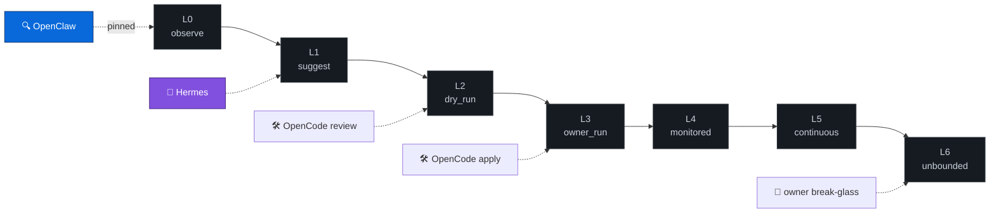
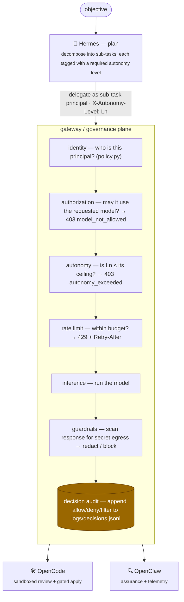
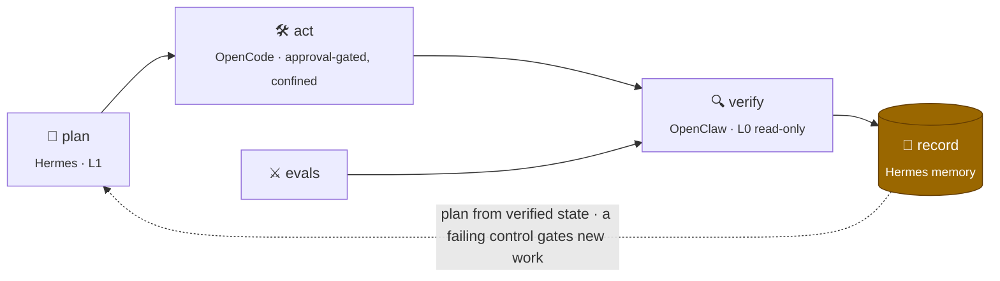

# Orchestration control plane

> **Thesis:** an AI system's *capability* to plan an action must not, by itself, be
> *authority* to perform it. This project separates the two: a planning layer may
> reason about anything, but what actually executes is decided — and recorded — by an
> enforceable governance plane.

Most agent demos show the capability side (a model that plans and calls tools) and
hand-wave the control side. The point of this project is the control side: the
boundary that decides which agent, acting as which principal, may take which action,
at which autonomy level, against which model.

## Components

The control plane is three cooperating components. They are **components defined by
behaviour**, not roles or job titles — each is a concrete process with a specific
mandate and a specific autonomy ceiling.

| Component | Mandate | Acts through |
|---|---|---|
| **Hermes** | Planning / orchestration. Decomposes an objective into a structured plan, decides which component should handle each sub-task, and routes the delegation. Hermes plans; it does not execute. | The gateway, as an identified principal |
| **OpenCode** | Code-execution agent. Inspects, tests, and (under approval) modifies code. Intended to run inside an isolated environment (network-restricted, scoped filesystem, resource-limited). | A sandbox, invoked as a constrained principal |
| **OpenClaw** | Security / assurance agent. Verifies that the governance plane's controls actually held — reads the decision audit, metrics, and OpenCode's isolation manifests and emits a structured assurance report. Observes; never acts. | Read-only evidence surfaces + `GET /metrics` |

Each component authenticates to the gateway as its **own principal** (its own API
key, its own `allowed_models`, token cap, rate limit, and autonomy ceiling in
`config/policy.toml`). There is no shared "god" identity in normal operation — the
owner token is a break-glass admin (L6), not the orchestrator's day-to-day identity.

## The autonomy ladder (L0–L6)

Delegated work is classified by how much autonomy it requires. The gateway enforces a
ceiling per principal, so a component cannot be delegated work above its mandate even
if the plan asks for it.

| Level | Name | Meaning |
|---|---|---|
| L0 | observe | read / observe only |
| L1 | suggest | propose text or plans; take no action |
| L2 | dry_run | dry-run / no-op execution (`bash -n`, schema validation) |
| L3 | owner_run | owner-initiated local execution |
| L4 | monitored_auto | finite, monitored automation |
| L5 | continuous_auto | continuous automation |
| L6 | unbounded | unbounded autonomy (break-glass / owner only) |

Each principal is **pinned** to a ceiling. The gateway enforces it on every request, so
no component can be handed work above its mandate — not even if the plan asks:

A request declares its intended level via the `X-Autonomy-Level` header or an
`autonomy_level` body field (`"L3"`, `"3"`, or `3` are accepted). The gateway compares
it to the principal's ceiling (`max_autonomy_level`, else the `[autonomy]`
`default_max_level`). If the request exceeds the ceiling it is denied **before any
model loads** with `403 autonomy_exceeded`, and the denial is written to the decision
audit. When no ceiling is configured anywhere, gating is off (opt-in).

This is the keystone: it converts the original prompt-level autonomy governance
(a boot prompt that *asked* the model to behave) into a control that is *enforced in
code*.

## Delegation flow

Every delegation is an *authorization decision*, and every decision is recorded. The
audit trail (`logs/decisions.jsonl`) is therefore a complete record of which component
was permitted to do what — the artifact a reviewer or SIEM actually wants.

## Standards-aligned surfaces: A2A + MCP

The 2026 agent stack splits into two protocols: **A2A** (Agent2Agent — *horizontal*, agent
talks to agent) and **MCP** (Model Context Protocol — *vertical*, agent talks to tools).
They are complementary, and the governance plane sits underneath both: the *same* identity →
authorization → autonomy → audit pipeline gates a delegation and a tool call exactly as it
gates inference.

- **A2A.** `GET /.well-known/agent-card.json` serves an A2A Agent Card rendered **from
  policy** — it advertises only the skills a principal is granted (`allowed_skills`) and
  surfaces the principal's enforced **autonomy ceiling**, so a peer decides a handoff against
  authority rather than a self-description. `POST /a2a/tasks` accepts a delegated task only if
  the principal holds the skill and the declared level is within its ceiling, else
  `403 skill_not_allowed` / `403 autonomy_exceeded`. This makes the Hermes → OpenCode →
  OpenClaw handoffs a standards-shaped, governed pattern (and addresses OWASP Agentic ASI07).

- **MCP.** `POST /mcp/call` gates every tool invocation by the principal's `allowed_tools`
  *and* a per-tool autonomy floor (each tool declares the level it requires), refusing
  ungranted or over-privileged calls before any handler runs (`403 tool_not_allowed` /
  `403 autonomy_exceeded`). "A tool call is not authority unless granted" — the same thesis as
  "model output is not authority" (OWASP Agentic ASI02). Built-in tools are pure/side-effect-free;
  a high-blast-radius tool would simply carry a high autonomy floor.

Both surfaces are proven by the adversarial eval suite (`A2A-001/002`, `MCP-001`) and unit
tests, so the authority claim is enforced and regression-gated, not asserted.

## Status — what is enforced today vs. planned

Honesty about the boundary is part of the design.

**Enforced now (in this repo):**

- Per-principal identity, model authorization, token caps, and rate limits.
- **Autonomy-ceiling enforcement** (L0–L6) on inference requests.
- Secret-egress guardrails on responses.
- Structured decision audit + Prometheus metrics for every decision.
- **OpenCode runs as a capability-denied, isolation-verified reviewer.** The harness at
  [`agents/opencode_sandbox/`](../agents/opencode_sandbox) runs OpenCode with `edit`/`bash`/
  `task`/network/`lsp` denied (only `read`/`glob`/`grep`/`list` allowed), under an isolated
  XDG config so it never touches the operator's real OpenCode config, against a *copy* of the
  target — then diffs before/after `sha256` manifests of the sandbox and `~/.config/opencode`
  to prove no out-of-sandbox writes (`ISOLATION_RESULT=PASS`). Its only model provider is the
  loopback gateway.
- **Hermes runs as a stateful planner that delegates through the gateway.** The component at
  [`agents/hermes/`](../agents/hermes) loads persistent memory (`PROJECT_STATE.json`,
  `RUN_HISTORY.md`, `NEXT_ACTIONS.md`), composes a planning request from its contract + state,
  delegates one cycle to the gateway **as the `hermes` principal capped at autonomy L1
  (suggest)**, parses the structured plan, and records it back to memory (atomic writes +
  pre-write backup). It plans; it does not execute. Asking to operate above L1 is denied by the
  same autonomy gate (`403 autonomy_exceeded`) and audited — the planner holds no special
  privilege.
- **OpenClaw runs as a read-only assurance verifier.** The component at
  [`agents/openclaw/`](../agents/openclaw) reads the evidence the plane already emits — the
  decision audit, the `/metrics` counters, OpenCode's isolation manifests, and the policy — and
  runs **nine** controls over it (`AC-AUDIT-INTEGRITY`, `AC-AUTONOMY-CEILING`, `AC-AUTHZ-MODEL`,
  `AC-RATELIMIT`, `AC-GUARDRAIL-EGRESS`, `AC-METRICS-RECONCILE`, `AC-OPENCODE-ISOLATION`,
  `AC-APPLY-INTEGRITY`, `AC-SECURITY-EVALS`). It
  emits a structured **assurance report** (PASS / FAIL / INCONCLUSIVE per control) and exits
  non-zero only on FAIL. It runs **observe-only (autonomy L0)**: it reconciles independent
  evidence streams and surfaces gaps, but it changes nothing and has no authority to clear its
  own findings. This is the assurance step the roadmap puts *before* widening any implementer's
  authority — the verifier is defined first.
- **The assurance → planning loop is closed.** `hermes.verify` (the composition root at
  [`agents/hermes/verify.py`](../agents/hermes/verify.py)) runs OpenClaw over the evidence and
  folds the verdict back into Hermes' memory: the canonical state gains an `assurance` block, the
  run history records the verification, and the next gate becomes *remediate the first failing
  control* on FAIL. The next planning cycle therefore reads the verified result — a failing
  control appears in Hermes' planning prompt and, by contract, gates new work until it is fixed.
  The two leaf packages stay decoupled: they meet only at a small JSON assurance record, not at
  each other's types.
- **The act step is enforced too.** OpenCode's apply path
  ([`agents/opencode_sandbox/apply.py`](../agents/opencode_sandbox/apply.py)) refuses any change
  without an explicit owner approval (fail-closed, ≥ L3, no under-declaring), applies only into a
  sandbox copy, and verifies via sha256 manifests that it changed *exactly* the files it declared.
  The resulting apply report is folded into OpenClaw's `AC-APPLY-INTEGRITY` control, so an ungated
  or escaping apply becomes a failing control that gates the next plan. Likewise the adversarial
  eval verdict (`evals/`) feeds `AC-SECURITY-EVALS`. The loop is closed on all four threads
  (plan → act → verify → record):

**Planned (next, behind the same boundary):**

- **OpenClaw probes:** add model-driven offensive-security / code-review checks for the
  `openclaw` principal (its `allowed_models` / L0 ceiling already exist in policy), on top of
  today's evidence-verification controls.
- **OpenCode OS-level jail:** additionally run the capability-denied review *and* the apply step
  under a kernel jail (seccomp/namespaces / `sandbox-exec`). The protocol-level gate and
  filesystem verification are done; the remaining hardening is the OS boundary.
- Approval gates (`APPROVAL REQUIRED`) for any L4+ *gateway* action, reusing the act step's
  approval model, surfaced to the owner.

See [roadmap.md](roadmap.md) for sequencing. All three components now have running
implementations: [`agents/hermes/`](../agents/hermes) (planner + verification loop),
[`agents/opencode_sandbox/`](../agents/opencode_sandbox) (isolated reviewer), and
[`agents/openclaw/`](../agents/openclaw) (assurance verifier).
