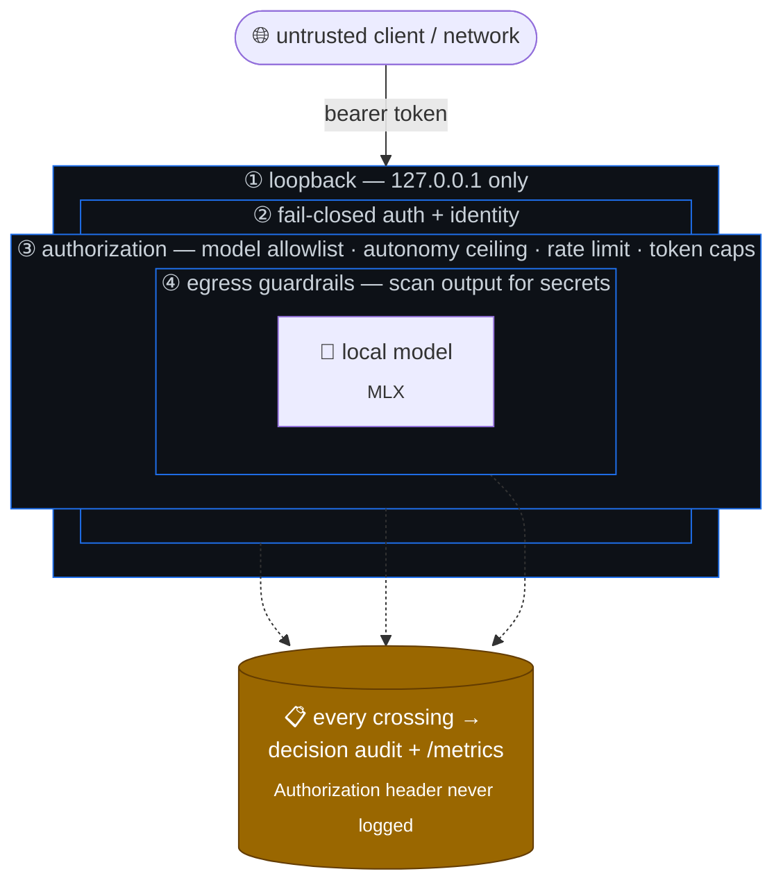

# Security Model

## Thesis

A model's ability to produce text is not authority to act. This gateway exists to make
that boundary explicit: local models are reachable only over loopback, behind
authentication, and their output is treated as untrusted — in particular, the gateway
**refuses to fake tool execution**.

This is a defensive lab design, not a compliance claim.

## Scope

In scope: the Flask gateway (`src/private_ai_gateway/app.py`) and its nginx loopback
boundary (`deploy/nginx/nginx.conf`).

Out of scope: the model weights themselves, the host OS, and any client that calls the
gateway. The operator wrappers (`agents/wrappers/`) are owner-run and covered briefly
below.

## Trust boundaries

Controls are layered (defense in depth): an attacker must cross every ring, and each ring
fails closed and is logged. The diagram shows where each boundary sits relative to the
untrusted client and the model:

| Boundary | Control | Status |
|---|---|---|
| Network | bind to `127.0.0.1` only (Flask + nginx) | active |
| Authentication | constant-time bearer check; fail-closed (won't start without a token) | active, see limits |
| Identity | bearer token resolved to a principal via policy-as-code (API-key SHA-256 hashes) | active |
| Authorization | per-principal model allowlist; unauthorized model → 403 | active |
| Autonomy | per-principal L0–L6 ceiling; request above ceiling → 403 `autonomy_exceeded` | active (opt-in via policy) |
| Request rate | per-principal token-bucket limiter; over-limit → 429 + `Retry-After` | active |
| Secret egress | response guardrails redact/block credential-shaped output | active (opt-in via policy) |
| Model output | sanitizer strips thinking / tool / control markers | active (defense-in-depth) |
| Tool execution | not performed by the gateway; tool-call output blocked + text fallback | active |
| Input volume | request body capped via `MAX_CONTENT_LENGTH` (default 8 MiB) | active |
| Output volume | tightest of request / per-model / per-principal token cap | active |
| Observability | text audit log + structured decision audit (`decisions.jsonl`) + Prometheus `/metrics`; Authorization header never logged | active |
| Operator wrappers | project-root jail, read-only inspection, monitoring-only ops | active |

## Risks addressed (OWASP LLM / MITRE ATLAS framing)

This gateway targets a focused subset rather than claiming broad coverage:

- **LLM01 Prompt injection / LLM06 Excessive agency** — the gateway never grants the
  model execution authority; tool-call output is blocked, not forwarded. A compromised
  prompt cannot turn into an action through this path. Beyond that, the **autonomy ceiling**
  caps each principal on an L0–L6 ladder, so even an authorized agent cannot be delegated
  work above its mandate — capability is bounded by enforced authority, not by prompt text.
- **Broken access control / least privilege** — identity and authorization are
  policy-as-code: each API key maps to a principal constrained to specific model aliases
  and token caps. A leaked low-privilege key cannot reach a model it was never granted,
  and every allow/deny decision is recorded for audit.
- **LLM02 Insecure output handling** — model output is sanitized before it reaches the
  client (thinking wrappers, fake tool calls, stray control tokens removed).
- **LLM02 Sensitive information disclosure (egress)** — output guardrails scan responses
  for credential-shaped content (cloud keys, private-key blocks, API tokens, JWTs) and
  redact or block them by policy, so an authorized caller cannot exfiltrate secrets the
  model surfaced.
- **Model denial-of-service (output / volume)** — per-model output-token caps bound runaway
  generations, and a per-principal token-bucket rate limiter bounds request volume so one
  key cannot saturate the single-process gateway.
- **Unbounded autonomy** — there is no agent loop in the gateway; the operator runs
  deterministic commands.

ATLAS-style: the design assumes the model may attempt to emit
adversarial/agentic output and contains it at the boundary rather than trusting it.

## Limitations and non-goals (read this)

Honesty about what is *not* yet hardened is part of the design:

- **API keys are static** — identities come from a policy file of API-key hashes, but
  there is no automatic key rotation or expiry yet, and the owner (`PRIVATE_AI_AUTH_TOKEN`)
  token is an all-models break-glass identity. Treat this as a loopback governance gate,
  not a public IdP-backed auth system.
- **The output sanitizer and egress guardrails are regex denylists.** They are
  defense-in-depth for *known* marker and credential shapes, not a guarantee against novel
  or obfuscated ones. The guardrail patterns are high-precision (tuned to avoid mangling
  ordinary prose), which means they favor low false positives over exhaustive recall — do
  not rely on either as a sole control.
- **Rate limiting is in-process and per-node.** The token-bucket state lives in the single
  gateway process, which is the correct scope for a loopback single-node service but is not
  a distributed quota.
- **No TLS.** The gateway is intended for loopback use only; do not expose it.
- **Single-user by construction** (one global model reference, single-threaded) — this
  is not a multi-tenant service.

These are tracked as hardening work in [roadmap.md](roadmap.md).

## Operator wrappers

`agents/wrappers/opencode.sh` and `openclaw.sh` are owner-run helpers, intentionally
least-privilege: a realpath-based project-root jail, read-only inspection and syntax
tests only, no process control or service restarts, and patch application is a no-op
behind an explicit `--confirm`. They are not wired into the gateway as autonomous tools.
