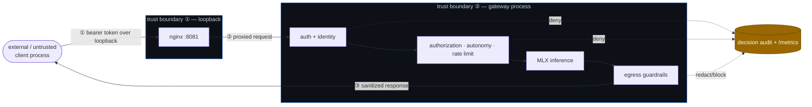

# Threat Model

This is a **defensive lab threat model**, not a compliance attestation. It states the
adversary, the trust boundaries, the STRIDE categories that matter at each boundary, the
control that addresses them, and — the part that makes it more than a checklist — the
**executable proof** that the control holds. Every "Proven by" entry is a test or an
adversarial eval that runs in CI, so this document cannot silently drift from the code.

See [security-model.md](security-model.md) for the narrative and honest limitations, and
[architecture.md](architecture.md) for the request path.

## Adversary & assumptions

- **Adversary.** A caller who can reach the loopback port (a local process, a compromised
  client, or a misbehaving/over-eager agent) and the model's own output (treated as
  untrusted — it may be prompt-injected or attempt to act).
- **In scope.** The Flask gateway, its governance plane, the nginx loopback boundary, and
  the agent control plane's authorization decisions.
- **Out of scope.** Host OS, model weights, physical access, and the human operator. No TLS
  (loopback only). Keys are static (no rotation yet). See the limitations section in the
  security model.
- **Security objective.** A model's ability to produce text is **never** authority to act,
  to reach an ungranted model, to exceed its autonomy mandate, or to exfiltrate secrets —
  and every such attempt is denied *and recorded*.

## Data-flow & trust boundaries



The three numbered crossings are where trust changes hands: ① untrusted → loopback,
② loopback → authorized principal, ③ model output → client.

## STRIDE per boundary

Each row: the threat, the control that mitigates it, and the executable proof. Eval IDs
live in [`evals/cases.py`](../evals/cases.py) (OWASP-LLM tagged, run via `make evals`);
unit tests live in [`tests/unit/`](../tests/unit); `AC-*` controls are OpenClaw assurance
checks in [`agents/openclaw/checks.py`](../agents/openclaw/checks.py).

### ① Loopback boundary (untrusted → gateway)

| STRIDE | Threat | Control | Proven by |
|---|---|---|---|
| **S**poofing | request from off-host / another interface | bind `127.0.0.1` only (Flask + nginx) | `deploy/nginx/nginx.conf`; loopback bind in `app.py` |
| **D**oS | oversized request body | `MAX_CONTENT_LENGTH` (8 MiB) input cap | `app.py` request-size limit |
| **I**nfo disclosure | bearer token leaks into logs | `Authorization` header is never logged | `audit.py`; `test_auth` |

### ② Authentication & identity (gateway → principal)

| STRIDE | Threat | Control | Proven by |
|---|---|---|---|
| **S**poofing | no / wrong / forged token | fail-closed, constant-time bearer check; won't start without a token | `evals` **AUTHN-001/002** · `test_auth` |
| **T**ampering | guessing a principal by key | keys stored as **SHA-256 hashes**, never plaintext; token hashed to resolve principal | `policy.py` (`hash_token`) · `test_policy` |
| **R**epudiation | "I never made that call" | every decision → `logs/decisions.jsonl` (request id, principal, model, reason) | `AC-AUDIT-INTEGRITY` · `test_openclaw_checks` |

### ③ Authorization, autonomy & rate (the principal's mandate)

| STRIDE | Threat | Control | Proven by |
|---|---|---|---|
| **E**oP — model | low-priv key reaches an ungranted model | per-principal `allowed_models` → `403 model_not_allowed` | `evals` **AUTHZ-001** · `test_policy` |
| **E**oP — autonomy | agent declares more autonomy than its mandate | L0–L6 ceiling → `403 autonomy_exceeded`, *before* model load | `evals` **AUTONOMY-001/002** · `test_autonomy` |
| **E**oP — under-declare | low level in header, high in body (smuggle privilege) | `declared_level` takes **most-privileged-wins** | `evals` **AUTONOMY-004** — *the real bug this caught & now regression-tests* |
| **D**oS | one key saturates the single-process gateway | per-principal token-bucket → `429 + Retry-After`, before model load | `evals` **RATELIMIT-001** · `test_ratelimit` |
| **D**oS | runaway generation | tightest of request / per-model / per-principal token cap | `test_governance_endpoints` |

### ④ Model output (egress → client)

| STRIDE | Threat | Control | Proven by |
|---|---|---|---|
| **I**nfo disclosure | model surfaces an AWS key / PEM / JWT / API token | egress guardrails `redact`/`block` credential shapes | `evals` **EGRESS-001…004** · `test_guardrails` |
| **E**oP — agency | model output smuggles a tool/function call | tool-call output **blocked**, replaced with text fallback (gateway refuses to fake execution) | `test_sanitizer` |
| **T**ampering | visible `<think>` / control markers leak into output | output sanitizer strips thinking/tool/control markers | `test_sanitizer` |

### ⑤ Agent control plane (delegated work)

| STRIDE | Threat | Control | Proven by |
|---|---|---|---|
| **E**oP | a code change applies without owner approval | apply path is fail-closed (≥ L3, explicit approval, no under-declaring) | `AC-APPLY-INTEGRITY` · `test_opencode_act` |
| **T**ampering | an apply escapes its sandbox / changes undeclared files | apply runs into a copy; sha256 manifests verify only declared files changed | `AC-APPLY-INTEGRITY` · `test_opencode_act` |
| **T**ampering | the reviewer writes outside its sandbox | capability-denied (edit/bash/network off), before/after manifests prove no escape | `AC-OPENCODE-ISOLATION` |
| **R**epudiation | a regression silently weakens a control | adversarial eval suite re-attacks every control and fails CI on regression | `AC-SECURITY-EVALS` · `make evals` |

## Defense-in-depth summary

No single control is load-bearing. An attacker reaching the model must cross **every** ring
of [security-model.md](security-model.md#trust-boundaries) — loopback → auth → authorization
→ egress — each failing closed and each logged. The agent control plane adds a second loop:
an independent **assurance** verifier (OpenClaw, read-only, L0) re-derives whether the
controls held from the audit/metrics/policy evidence, and a failing control gates the next
planning cycle. Capability is bounded by **enforced** authority, not by prompt text.

## How to re-verify

```bash
make evals     # re-run every adversarial attack above; non-zero on any regression
make test      # unit tests for each control
make           # full board incl. OpenClaw assurance over the example evidence
```

Run the controls against a *live* gateway: [runbook.md](runbook.md#live-enforcement-demo).
